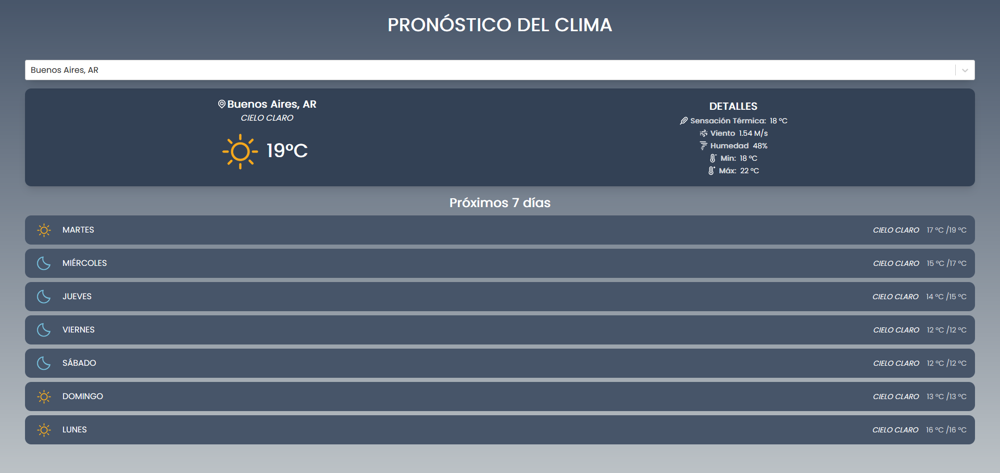

# 🌤️ App del clima desarrollada con React

## Preview 🎞️

### Deploy: 
[Click acá](https://react-app-weather-jc.vercel.app/)

## Herramientas utilizadas
- API de [***OpenWeatherMap***](https://openweathermap.org/api) y [***GeoDB Cities***](https://rapidapi.com/wirefreethought/api/geodb-cities)
- React Js 
- TailwindCSS
- Unicons
